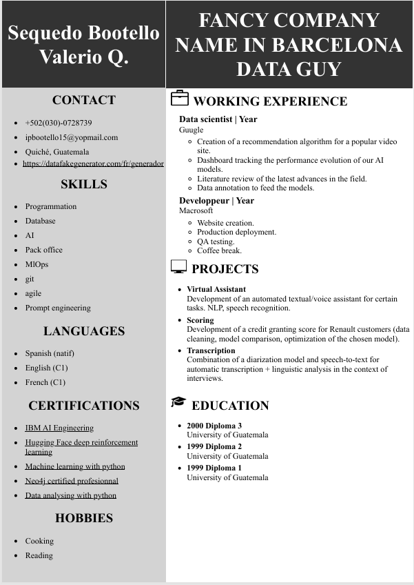
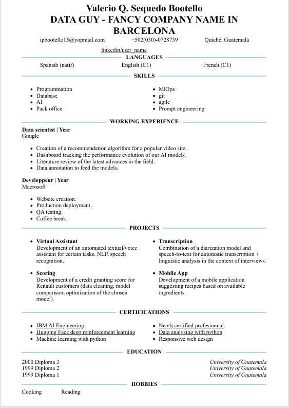

# CV Generator

## Overview
CV Generator is a Python project that generates a resume by converting HTML file to PDF using playwright.

## Example

  

## Features
- python 3.11

- File HTML template

- Export HTML to PDF

## Requirements

- bs4==0.02

- playwright==1.50.0


## USAGE

```
cv_gen = CV_editor()
cv_gen.run("data guy", "fancy company name in Barcelona", lang="en")
```

## Code Overview

CV_editor Class
- __init__(self) Load data from JSON files.

- load_json(self, filename: str) -> dict Load json file.

- template_choice(self, style: str = "cols") -> str Choose html template based on language and style.

- cv_selector(self, position: str) -> str Determines the job-related category based on keywords in the input position.

- fill_resume(self, style: str = "cols") -> str Fill resume based on given data.

- save_html(self, html: str) Save HTML file

- generate_pdf(self, html_file: str, output_path: str) -> None Generate pdf based on html file.

- run(self, position: str, company: str, lang: str = "fr", style: str = "cols") -> None Run resume generato pipeline.

## TODO
- Add other templates


## Contributing
Contributions are welcome! Feel free to submit a Pull Request or raise an issue if you find any bugs or have suggestions for improvements.

## License
This project is licensed under the MIT License. See the LICENSE file for more details.